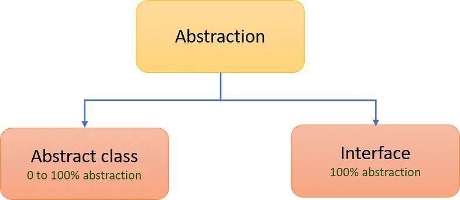
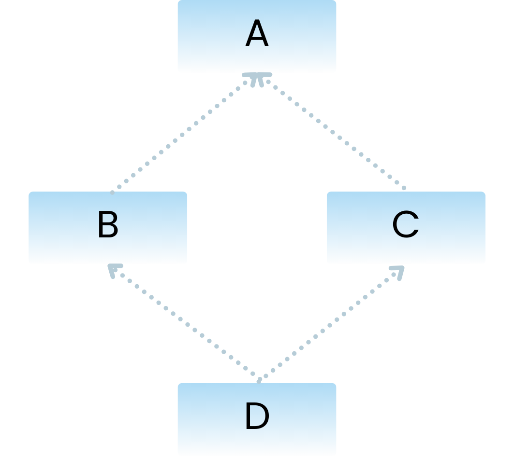

# 1. Why we need to use OOP? Some major OOP languages?

Nesne Yönelimli Programlama (OOP), gerçek hayattaki nesne, olay ve kavramların yazılım dünyasında temsil edilmesini sağlayan bir programlama yaklaşımıdır.

Bu yapı, yazılımcılara karmaşık problemleri daha düzenli, anlaşılır ve yönetilebilir bir şekilde ele alma imkânı tanır. Bu nedenle günümüzde birçok yazılım projesinde OOP yaklaşımı tercih edilmektedir. OOP’yi güçlü kılan temel prensipler ise kalıtım, kapsülleme, soyutlama ve çok biçimliliktir.

Kalıtım (inheritance), bir sınıfın başka bir sınıftan özellik ve davranışları miras almasını sağlar. Böylece kod tekrarı en aza inerken, yazılımın bakımı ve genişletilmesi kolaylaşır. Kapsülleme (encapsulation), nesnelerin verilerinin dışarıdan doğrudan erişime kapatılarak yalnızca kendi metotları aracılığıyla kontrol edilmesini sağlar. Bu, veri güvenliğini artırırken hata riskini azaltır.

Soyutlama (abstraction), kullanıcıya yalnızca gerekli olan bilgi ve işlevlerin sunulması, karmaşık detayların gizlenmesidir. Bu sayede yazılım daha sade, okunabilir ve yönetilebilir hale gelir. Çok biçimlilik (polymorphism) ise aynı metodun farklı nesneler üzerinde farklı şekillerde çalışabilmesini ifade eder. Bu özellik, yazılıma esneklik kazandırır ve sistemin zamanla genişletilmesini kolaylaştırır.

Tüm bu prensipler bir araya geldiğinde, OOP yaklaşımı yazılım geliştirme sürecini hem daha verimli hem de sürdürülebilir hale getirir. Geliştiricilerin karmaşık sistemleri daha etkili şekilde yönetmesini sağlarken, uzun vadeli projelerde başarı oranını da önemli ölçüde artırır.

---

### Bazı önemli OOP dilleri

- Java
- C#
- C++
- Python
- Ruby
- Php
- Swift

# 2. Interface vs Abstract class?

### Abstraction

Soyutlama (Abstraction)
Soyutlama, Nesne Yönelimli Programlama’nın (OOP) temel prensiplerinden biridir. Bir nesne ya da sınıfın detaylarını gizleyip yalnızca gerekli olan özellik ve işlevlerin sunulması anlamına gelir. Bu sayede programlar daha sade, açık ve anlaşılır hale gelir.

Nesneye yönelik programlamada soyutlama sağlamak için iki farklı yapı kullanılır: **abstract sınıflar** ve **interfaceler (arayüzler)**.

<p align="center">
	
</p>

### Abstract Classes

Abstract sınıflar, temel bir davranış yapısı tanımlamak ve bu davranışın alt sınıflar tarafından paylaşılmasını sağlamak amacıyla kullanılır.

- **abstract** anahtar kelimesi ile tanımlanırlar.
- Hem gövdeli (somut) hem de gövdesiz (soyut) metotlara sahip olabilir. Bu yüzden Java'da abstract classlarda %100 abstractiondan (soyutlama) sağlayamaz.
- Abstract sınıflardan doğrudan nesne oluşturulamaz; ancak bu sınıflardan türeyen alt sınıflardan nesne üretilebilir.
- Bir sınıf yalnızca bir abstract sınıftan kalıtım alabilir.
- Metotlar public, protected veya private olabilir.
- Normal değişkenler ve final değişkenler tanımlanabilir.
- Abstract sınıflar, constructor (yapıcı metot) ve static metotlar içerebilir.

> **Not:**  
>  abstract sadece sınıf ve metotlarda kullanılabilir. Değişkenlerde kullanılamaz.  
>  abstract metotlar gövdesizdir ve alt sınıflarda override edilmek zorundadır.

---

### Interface

Interfaceler, Java’da çoklu kalıtımı desteklemek ve farklı sınıflar arasında ortak bir yapı sağlamak amacıyla kullanılır. Kodun yeniden kullanılabilirliğini artırır.

- Yalnızca metot imzalarını içerir; metot gövdeleri bulunmaz. (Java 8 ve sonrasında, varsayılan (default) metotlar eklenebilir.)
- Interface bir sınıf değildir. Java’da bir sınıf yalnızca bir sınıftan miras alabilirken, birden fazla interface’i aynı anda uygulayabilir.
- Interface içerisindeki tüm metotlar otomatik olarak public olur.
- Değişkenler varsayılan olarak public, static ve final olur.
- %100 soyutlama sağlar çünkü yalnızca metot imzaları içerir.
- Interface’lerden doğrudan nesne oluşturulamaz.

# 3. Why wee need equals and hashcode? When to override?

Java’daki her sınıf, Object sınıfından türediği için varsayılan olarak **equals()** ve **hashCode()** metotlarını miras alır. Ancak, çoğu durumda bu varsayılan uygulamalar yetersiz kalabilir ve ınıfın ihtiyacına göre geçersiz kılınması (override edilmesi) gerekir.

**equals()** metodu, iki nesnenin birbirine eşit olup olmadığını belirlemek için kullanılır. Ancak varsayılan implementasyonu, yalnızca nesnelerin bellek adreslerini karşılaştırır (yani == operatörü gibi davranır). Bu da aynı içerikte bile olsa farklı nesnelerin eşit kabul edilmemesine neden olur.

**hashCode()** metodu ise bir nesnenin hash tabanlı veri yapılarındaki (örneğin HashMap, HashSet, Hashtable) konumunu belirleyen tam sayı değerini döndürür. Varsayılan haliyle bu değer, nesnenin bellek adresine göre oluşturulur.

**Örnek:**

```
import java.util.HashSet;

class Person {
    String name;
    int age;

    public Person(String name, int age) {
        this.name = name;
        this.age = age;
    }
}

public class Main {
    public static void main(String[] args) {
        Person person1 = new Person("Alice", 25);
        Person person2 = new Person("Alice", 25);

        // equals() ve hashCode() override edilmediği için referansları karşılaştırır
        System.out.println(person1.equals(person2));

        // HashSet içerisine aynı değere sahip iki nesneyi ekliyoruz
        HashSet<Person> people = new HashSet<>();
        people.add(person1);
        people.add(person2);

        System.out.println("Set size: " + people.size());
    }
}

```

**Çıktı:**

```
false
Set size: 2
```

Yukarıdaki örnekte aynı değerlere sahip iki farklı Person nesnesi oluşturulmuştur. Ancak varsayılan equals() metodu kullanıldığı için nesnelerin içerikleri değil, heap bellekteki adresleri karşılaştırılmıştır. Referanslar farklı adresleri işaret ettiğinden equals() sonucu false olmuştur. Aynı şekilde, nesneler farklı olduğu için hashCode() metodu da her biri için farklı tam sayı değerleri üretmiştir.

Eğer nesnelerin içeriğine göre karşılaştırma yapmasını istiyorsak, equals ve hashCode metotlarını override etmeliyiz.

> equals() metodunu override eden her sınıfta hashCode() metodunu da override etmek gerekir. Bunu yapmamak, Java'nın Object.hashCode() metodunun sözleşmesini ihlal eder ve HashMap, HashSet, Hashtable gibi hash tabanlı koleksiyonların düzgün çalışmasını engeller. equals ve hashCode birlikte override edilmezse, aynı içeriğe sahip iki nesne farklı hash kodlarına sahip olacağı için koleksiyonlarda beklenmeyen sonuçlar ortaya çıkabilir.

**Örnek:**

```
import java.util.HashSet;
import java.util.Objects;

class Person {
    String name;
    int age;

    public Person(String name, int age) {
        this.name = name;
        this.age = age;
    }

    // equals() metodu override edildi
    @Override
    public boolean equals(Object obj) {
        if (this == obj) return true;
        if (obj == null || getClass() != obj.getClass()) return false;
        Person person = (Person) obj;
        return age == person.age && Objects.equals(name, person.name);
    }

    // hashCode() metodu override edildi
    @Override
    public int hashCode() {
        return Objects.hash(name, age);
    }
}

public class Main {
    public static void main(String[] args) {
        Person p1 = new Person("Alice", 25);
        Person p2 = new Person("Alice", 25);

        System.out.println(p1.equals(p2));

        // HashSet içerisine aynı değere sahip iki nesneyi ekliyoruz
        HashSet<Person> people = new HashSet<>();
        people.add(p1);
        people.add(p2);

        System.out.println("Set size: " + people.size());
    }
}

```

**Çıktı:**

```
true
Set size: 1
```

Bu örnekte, aynı içeriğe (isim ve yaş) sahip iki farklı Person nesnesi oluşturulmuştur. equals() metodu override edildiği için nesneler, bellek adreslerine göre değil, içeriklerine göre karşılaştırılmıştır. Bu nedenle p1 ve p2 nesneleri aynı değerlere sahip olduğundan equals() metodu true sonucunu üretmiştir.

Aynı şekilde hashCode() metodu da override edildiğinden, içerikleri aynı olan bu iki nesne aynı hash değerine sahip olmuş ve HashSet içerisine yalnızca bir kez eklenmiştir. Böylece, hash tabanlı veri yapıları, nesneleri içeriklerine göre doğru şekilde ayırt edebilmiştir.

# 4. Diamon problem in Java? How to fix it?

Diamond problemi, çoklu kalıtım (multiple inheritance) kullanılan dillerde ortaya çıkan bir sorundur. Bir sınıf, iki farklı üst sınıftan kalıtım aldığında ve bu üst sınıflar aynı imzaya sahip bir metot içerdiğinde, hangi metot çağrılacağı konusunda belirsizlik oluşur.

<p align="center">
	
</p>

Yukardaki durumda, D sınıfı aynı imzaya sahip bir metodu çağırdığında, B sınıfından mı yoksa C sınıfından mı miras alınan metodu kullanacağı belirsiz hale gelir.

Java, sınıflar arasında çoklu kalıtımı desteklemez çünkü bu durum diamond problemi gibi belirsizliklere, kod karmaşıklığına ve bakım zorluklarına yol açabilir. Bunun yerine, Java interface’ler aracılığıyla çoklu kalıtımın bazı avantajlarını sunar.

### Nasıl Düzeltilir?

Interface’ler yalnızca metod imzalarını içerdiğinden, bir sınıf birden fazla interface’i uyguladığında, aynı isimde metotlar çakışsa bile, sınıf bu metotları kendi içinde bir kez implemente edebilir veya belirli bir interface’in metodunu super anahtar kelimesiyle çağırarak çakışmayı çözebilir. Böylece, Java’da çoklu kalıtımın getirdiği belirsizlikler önlenmiş olur ve kod daha yönetilebilir hale gelir.

# 5. Why we need Garbagge Collector? How does it run?

Çöp Toplama (Garbage Collection), program çalışırken kullanılmayan blokları tespit edip serbest bırakarak heap (dinamik bellek) yönetimini kolaylaştıran bir mekanizmadır. Çöp toplama bazı dillerde manuel olarak yönetilirken bazılarında otomatiktir. Örneğin C++’ da manuel olarak yönetilirken, Java’da böyle bir maliyet söz konusu değildir.

Java programlarında nesneler oluşturulduğunda, bu nesneler dinamik bellekte saklanır. Zamanla program daha fazla nesne oluşturduğunda, dinamik bellek dolmaya başlar ve bu durum programın yavaşlamasına hatta çökmesine neden olabilir. İşte bu noktada Garbage Collector devreye girerek bu sorunu önlemeye yardımcı olur.

- Program tarafından kullanılmayan ve erişilemez hale gelen nesneleri otomatik olarak tespit edip dinamik belleği bu nesnelerden temizler.
- Uygulama yığınındaki nesnelerin yaşam döngüsünü yönetir.
- Erişilemeyen nesneleri tanımlarken çalışan threadler (iş parçacıkları) tarafından hala erişilebilir olanları kontrol eder.
- Bir nesne artık referansa sahip olmadığında ve başka bir nesne tarafından kullanılmadığında, "çöp" olarak kabul edilir. Garbage Collector belirli periyotlarla yazımızda değineceğimiz algoritmaları kullanarak temizlik işlemi yapar.
- Dinamik belleğin verimli olarak kullanılabilmesi için çöp toplama işlemin belirli periyotlarla yapılması gerekmektedir. Java’daki Garbage Collector, geliştiricileri dinamik bellek yönetimi karmaşıklığından koruyarak geliştiricilere kod yazmaya odaklanma fırsatı sunar.

# 6. Java ‘static’ keyword usage?

Static deyimi, sınıf değişkenlerini ve ya sınıf metotlarını tanımlarken kullanılır.

Sınıflar içinde bulunan alanlar (değişkenler) ve metotlar, o sınıftan oluşturulan her nesneye özgüdür. Bu yüzden, nesneye ait olan değişkenlere "nesne değişkeni" (instance variable), metotlara ise "nesne metodu" (instance method) denir. Bir sınıftan oluşturduğumuz her nesne, kendi nesne değişkenlerine ve metotlarına sahip olur; dolayısıyla bu değerler her nesne için farklı olabilir. Ancak Java’da sadece nesneye değil, doğrudan sınıfa ait değişkenler ve metotlar da tanımlamak mümkündür. İşte tam bu noktada static anahtar kelimesi devreye girer.

### static Değişken (Class Variable)

Sınıf değişkenleri her bir nesne için ortak olan, sadece bir örneği bulunan, başka bir deyişle değeri nesneden nesneye değişmeyen, her nesne için aynı olan değişkenlerdir.

Static anahtar kelimesi kullanılarak oluşturulan değişkenler “sınıf değişkeni (class variable)” olarak adlandırılırlar. Bu değişkenler sınıfa ait bilgileri taşırlar. Sınıf değişkenleri içinde tanımlandığı sınıftan hiçbir nesne oluşturulmamış olsa bile bellekte yer kaplarlar. Bir sınıftan kaç tane nesne oluşturulursa oluşturulsun, bellekte tek bir tane sınıf değişkeni vardır. Nesne üzerinden ya da sınıf adı üzerinden erişilebilir.

**Örnek:**

```
class Employee {
    static int companyBudget = 100000; // Tüm nesneler için ortak
    int salary;

    Employee(int salary) {
        this.salary = salary;
    }
}

public class Main {
    public static void main(String[] args) {
        Employee emp1 = new Employee(5000);
        Employee emp2 = new Employee(7000);

        System.out.println(Employee.companyBudget); // 100000
        emp1.companyBudget -= 5000; // Static değişken değiştirildi
        System.out.println(Employee.companyBudget); // 95000
    }
}

```

### static Metot (Class Method)

Bir davranışın gerçekleştirmesi o nesnenin durumundan tamamen bağımsız ise, diğer bir deyişle nesnenin o anki durumu metodun üreteceği sonuca etki etmeyecekse, o metod static olmalıdır.

Normal şartlarda bir sınıftaki bir metodu çalıştırmak istiyorsak, önce o sınıfı kullanarak bir nesne oluşturmalı, sonra bu nesne referansı üzerinden metodu çağırmalıyız. Ancak değişkenlerde olduğu gibi metotlar için de static kelimesini kullanarak nesnelerden bağımsız sınıf metotları yazabiliriz. Sınıf metotlarını çağırmak için o sınıftan bir nesne oluşturmamız gerekmez. Sınıf ismi ile bu metotları çağırmamız mümkündür.

> **Not:**
> static method içerisinden yalnızca static sınıf öğeleri kullanabilir, çünkü nesneye özgü verilere erişemez.

**Örnek:**

```
class MathUtils {
    static int square(int num) {
        return num * num;
    }
}

public class Main {
    public static void main(String[] args) {
        System.out.println(MathUtils.square(5));
    }
}

```

Nesne oluşturmadan MathUtils.square(5) şeklinde çağırabildik.

> Static metotlar, this anahtar kelimesini kullanamaz! Çünkü this nesneye özeldir, static ise sınıfa aittir.

### static Blok (Static Initialization Block)

Static kod blokları static değişkenlere ilişkin ilk değer atamalarını yapmak için kullanılan kod bloklarıdır. Bunlara literatürde “static initializer” denmektedir.

**Örnek:**

```
class Database {
    static String connectionUrl;

    static {
        connectionUrl = "jdbc:mysql://localhost:3306/mydb";
        System.out.println("Static blok çalıştı, bağlantı başlatıldı.");
    }
}

public class Main {
    public static void main(String[] args) {
        System.out.println(Database.connectionUrl);
    }
}

```

Sınıf çağrıldığında static blok çalışır ve değişken başlatılır.

> Java’da main metodunun imzası sabittir. Main metodu public ve static olmak zorundadır. Bu metodun public olması gerektmektedir çünkü kodumuzu çalıştıran JVM’nin dışarıdan main metodunu çalıştırabilmesi gerekir. Bu metodun ayrıca static de olması gerekir çünkü JVM kodumuzu çalıştırırken main metodunun yazılı olduğu sınıftan bir nesne oluşturmaz. Ortada nesne yokken bir metodu çalıştırmak için de o metodun static olarak tanımlanmış olması gerekir.

# 7. Immutability means? Where, How and Why to use it?

Immutability, bir nesne oluşturulduktan sonra içeriğinin değiştirilememesi durumudur. Yani bir nesne immutable ise, o nesnenin sahip olduğu veriler (field’lar) sonradan değiştirilemez. Yeni bir değer atamak yerine, genellikle yeni bir nesne oluşturularak işlem yapılır. Bu nesnelere örnek olarak, String, Integer, Float ve benzeri hazır sınıflar gösterilebilir.

Java’da en yaygın kullanılan immutable sınıflardan biri String sınıfıdır.

**Örnek:**

```
String str = "Hello World!";
str.toUpperCase();
```

Yukardaki örnekte toUpperCase() metodu "Hello World!"yu "HELLO WORLD!"ya çevirse de, orijinal str değişkeni değişmez. Bunun yerine yeni bir String nesnesi döner.

Nerede Kullanılır;

- Veri transfer nesnelerinde (DTO)
- Hash tabanlı koleksiyonlarda (HashMap, HashSet) anahtar olarak
- Çoklu iş parçacığı (multi-threading) kullanılan ortamlarda
- Fonksiyonel programlama yapılarında kullanılabilir.

### Immutable Sınıf Nasıl Oluşturulur?

- Sınıf final olmalı (miras alınamaz)
- Değişkenler private final olmalı (değiştirilemez)
- Setter metot yazılmaz
- Constructor ile tüm alanlar bir kez set edilir
- Koleksiyon veya nesne varsa, kopyası döndürülür

**Örnek:**

```
public final class Person {
    private final String name;
    private final int age;

    public Person(String name, int age) {
        this.name = name;
        this.age = age;
    }

    public String getName() {
        return name;
    }

    public int getAge() {
        return age;
    }
}
```

**Örnek:**

```
Person p1 = new Person("Alice", 30);
// p1.setName("Bob"); // Böyle bir metot yok çünkü değiştirilemez!

System.out.println(p1.getName()); // "Alice"

Person p2 = new Person("Bob", 30);

System.out.println(p2.getName());
System.out.println(p1.getName());
```

**Çıktı:**

```
Alice
Bob
Alice
```

Yukardaki örnekte görüldüğü gibi bir nesne oluşturulduktan sonra içerik sabit kalır. Eğer yeni bir veri gerekiyorsa, yeni bir nesne oluşturulur.

Immutability, özellikle çok iş parçacıklı (multi-threaded) uygulamalarda güvenli ve öngörülebilir veri yönetimi sağlamak amacıyla tercih edilen temel bir yaklaşımdır. Immutable nesneler, oluşturulduktan sonra durumlarını değiştirmeye izin vermediğinden, senkronizasyon gerektirmeksizin birden fazla iş parçacığı tarafından güvenli bir şekilde paylaşılabilirler. Bu özellik, eşzamanlı (concurrent) uygulamalarda hem performans artışı hem de veri tutarlılığı sağlar. Ayrıca, değiştirilemez nesneler uygulama genelinde yan etkisiz (side-effect-free) davranış sergiledikleri için, hata ayıklama sürecini kolaylaştırır ve beklenmedik durumların önüne geçer. Bu durum, test edilebilirliği önemli ölçüde artırır çünkü nesnelerin durumu dışsal etkenlerle değişmeyeceğinden, her test aynı sonucu üretir. Ek olarak, immutable nesneler, HashMap ve HashSet gibi hash tabanlı koleksiyonlarda anahtar olarak güvenle kullanılabilir; çünkü nesnenin equals ve hashCode değerleri değişmeyeceği için veri bütünlüğü korunur.

# 8. Composition and Aggregation means and differences?

Nesne Yönelimli Programlama (OOP), yazılım geliştirmenin temel prensiplerinden biridir ve bu prensipler arasında nesneler arasındaki ilişkileri açıkça ifade etmek önemli bir rol oynar. Bu ilişkileri belirleyen ve düzenleyen üç önemli terim, association, aggregation ve composition olarak adlandırılır. Bu terimler, yazılım geliştiricilere nesneler arasındaki bağlantıları daha iyi anlamalarına ve tasarımlarını daha etkili bir şekilde oluşturmalarına yardımcı olur.

### 1) Composition

Composition ilişkisi, bir sınıfın birden fazla bağlı olduğu sınıflar arasında özel bir ilişki türünü ifade eder. Bu ilişkide, ana sınıf, bağlı olduğu diğer sınıflar olmadan var olabilir; ancak bağlı olduğu sınıflar, ana sınıf olmadan var olamazlar. Bu durum, güçlü bir bağlantıyı temsil eder, couple sıfatlandırması yapılabilir.

Bu ilişkiye has-a (sahiplik) ilişkisi de denebilir.

**Örnek:**

```
class Engine {
    // Motorun kendi özellikleri
}

class Car {
    private Engine engine = new Engine(); // Composition ilişkisi
}
```

Bu yapıda, Car sınıfı Engine nesnesini doğrudan içinde oluşturduğu için, bu iki nesne arasında "strong ownership" (güçlü sahiplik) vardır, yani composition ilişkisi kurulmuş olur. Engine yoksa Car var olamaz.

### 2) Aggregation

Zayıf bir ilişki türüdür (weak association). Nesneler arasında bağımsızlık vardır: Bir nesne, diğerinden bağımsız olarak da var olabilir. Yaşam döngüsü bağımsızdır: Sahip olan nesne silinse bile, bağlı olan nesne yaşamaya devam edebilir.

**Örnek:**

```
class Department {
    // Bölüm özellikleri
}

class University {
    private List<Department> departments;

    public University(List<Department> departments) {
        this.departments = departments;
    }
}
```

Department nesneleri dışarıdan oluşturulup University sınıfına enjekte edilir, Department nesneleri bağımsızdır, başka bir üniversiteye de atanabilir, University silinse bile, Department nesneleri yaşamaya devam edebilir.

Kısaca Aggregation ve Composition arasındaki mantıksal fark şudur: Aggregation sahip olunan nesnenin sahip olan nesneden bağımsız bir şekilde var olabilmesine denir. Composition ise sahip olunan nesnenin sahip olan nesneden bağımsız bir şekilde var olamamasına denir.

# 9. Cohesion and Coupling means and differences?

Yazılım mühendisliğinde kaliteli, sürdürülebilir ve bakımı kolay kod yazmanın temel taşlarından ikisi cohesion (uyumluluk) ve coupling (bağlılık) kavramlarıdır. Bu iki kavram, özellikle nesne yönelimli programlama (OOP) ve modüler sistem tasarımı açısından büyük önem taşır.

### 1) Cohesion (Uyumluluk / Tutarlılık)

Cohesion, bir modülün içerisindeki bileşenlerin (metotlar, değişkenler vb.) işlevsel olarak ne kadar ilişkili olduğunu ifade eden bir ölçüdür. Bu, tamamen modül içi bir kavramdır. Bir modül, tek bir sorumluluğu yerine getiren ve aynı amaca hizmet eden öğeleri barındırmalıdır.

Bu bağlamda, SOLID prensiplerinin "S" harfi olan Single Responsibility Principle (Tek Sorumluluk İlkesi) cohesion kavramını doğrudan destekler. Yani bir sınıf ya da modül, yalnızca tek bir işten sorumlu olmalı ve bu sorumlulukla ilgili olan tüm işlevleri kendi içinde barındırmalıdır.

Eğer bir modül içerisinde birbiriyle ilgisi olmayan, bağımsız metotlar ya da veriler bulunuyorsa, bu öğeler farklı modüllere ayrılmalı ve her modül yüksek cohesion (High Cohesion) ilkesine uygun şekilde, kendi görevine odaklanacak biçimde yapılandırılmalıdır.

Bu prensip kodun yeniden kullanılabilirliğini, test edilebilirliğini ve bakım kolaylığını büyük ölçüde artırır.

### 2) Coupling (Bağlılık)

Coupling, modüller arasındaki karşılıklı bağımlılık derecesini ifade eder. Bu kavram, tamamen modüller arası bir ilişkiyi tanımlar ve iki temel alt kavramı içerir: Gevşek Bağlılık (Loosely Coupled) ve Sıkı Bağlılık (Tightly Coupled).

Tightly Coupled (sıkı bağlı) sistemlerde, modüller birbirine sıkı sıkıya bağlıdır. Bir modülde yapılan herhangi bir değişiklik, doğrudan diğer modülleri etkiler. Bu durum, sistemin bakımını zorlaştırır, genişletilebilirliğini azaltır ve geliştirme maliyetini artırır.

Bu nedenle, yazılım sistemlerinde mümkün olduğunca Loosely Coupled (gevşek bağlı) yapıların tercih edilmesi gerekir. Gevşek bağlı sistemlerde, bir modülde yapılan değişiklik diğer modülleri etkilemez. Bu da sistemin esnekliğini, test edilebilirliğini ve yeniden kullanılabilirliğini artırır.

# 10. Heap and Stack means and differences?

Yüksek seviyeli programlama dillerinde, bellek yönetimi iki temel alan üzerinden gerçekleştirilir: Heap (Yığın) ve Stack (Yığın Bellek). Bu iki yapı, verilerin bellekte nasıl tutulduğunu, yaşam süresini, erişim hızını ve yönetim şeklini belirler. Doğru kullanımları, hem performans hem de sistem kararlılığı açısından büyük önem taşır.

### 1) Stack

Stack belleği, her bir iş parçacığı (thread) için ayrı olarak tahsis edilen, sınırlı fakat oldukça hızlı bir bellek alanıdır. Bu alanda, metot çağrıları sırasında oluşan yerel değişkenler ve parametreler saklanır. Bir metot çağrıldığında, bu metot için gerekli olan tüm veriler stack üzerine eklenir ve metot tamamlandığında bu veriler otomatik olarak stack'ten silinir. Stack, “son giren ilk çıkar” (LIFO – Last In First Out) prensibiyle çalışır ve veriler üzerinde çok hızlı erişim sağlar. Ancak bu hız, belleğin sınırlı olmasıyla dengelenmiştir. Uygulama çok fazla metot çağırırsa ya da derin bir özyineleme yapılırsa “StackOverflowError” hatası meydana gelebilir.

### 2) Heap

Heap belleği, uygulama çalıştığı sürece dinamik olarak oluşturulan nesnelerin saklandığı geniş bir bellek alanıdır. Programda new anahtar kelimesiyle oluşturulan tüm nesneler heap alanına yerleştirilir. Heap bellekte saklanan nesnelerin yaşam süresi, onlara referans verildiği sürece devam eder. Eğer bir nesneye artık erişilemiyorsa, Java'nın otomatik bellek yönetim sistemi olan Garbage Collector devreye girerek kullanılmayan nesneleri bellekten temizler. Heap belleği, daha büyük veri yapılarını tutmak için uygun olsa da, stack'e göre daha yavaştır; çünkü verilerin yönetimi daha karmaşıktır.

---

Genel olarak stack kısa ömürlü, küçük ve hızlı işlemler için kullanılırken, heap uzun ömürlü, büyük ve karmaşık nesnelerin yönetimi için kullanılır. Stack'te tutulan veriler genellikle temel (primitive) tipler ve nesne referanslarıdır; nesnelerin kendisi ise heap üzerinde yer alır.

# 11) Exception means? Type of Exceptions?

Exception (istisna), bir programın çalışması sırasında beklenmedik bir durumla karşılaştığında ortaya çıkan hata durumlarını ifade eder. Bu tür durumlar, normal akışı bozan olaylardır ve Java bu hataları kontrol altına alabilmek için exception handling (istisna yakalama) mekanizmasını sağlar.

Exception (istisna), bir programın çalışması sırasında beklenmedik bir durumla karşılaştığında ortaya çıkan hata durumlarını ifade eder. Bu tür durumlar, normal akışı bozan olaylardır ve Java bu hataları kontrol altına alabilmek için exception handling (istisna yakalama) mekanizmasını sağlar.

Java'daki tüm exception’lar Throwable sınıfından türemektedir. Throwable sınıfı, iki ana alt sınıfa ayrılır: Error ve Exception.

Error sınıfı, genellikle JVM tarafından üretilen ve programcıların müdahale etmemesi gereken ciddi sistem hatalarını temsil eder. Örneğin, bellek yetersizliği (OutOfMemoryError) gibi durumlar bu gruba girer.

Exception sınıfı kendi içinde ikiye ayrılır: Checked Exceptions (Derleyici Tarafından Kontrol Edilen) ve Unchecked Exceptions (Kontrol Edilmeyen).

### 1) Checked exceptions

- Checked exception, Java derleyicisi tarafından derleme zamanında kontrol edilir ve programcının yakalamak veya belirtmek zorunda olduğu hataları temsil eder.
- Bu tür hatalar, genellikle dosya okuma/yazma işlemleri, ağ bağlantıları, veritabanı işlemleri gibi dış kaynaklarla etkileşimli kod blokları sırasında oluşabilir.
- Checked exception'lar, "throws" anahtar kelimesiyle belirtilir ve programcılar, bu tür hataları yakalamak veya belirtmek zorundadır. Aksi takdirde derleme zamanında hata verirler.
- IOException, SQLException, ClassNotFoundException ve InterruptedException gibi durumlar, Checked exception örnekleridir.

### 2) Unchecked Exception

- Unchecked exception, çalışma zamanında ortaya çıkan hataları temsil eder.
- Bu tür hatalar, genellikle programcının kodunda yapılan hatalardan kaynaklanır, örneğin: null pointer exception, arithmetic exception vb.
- Unchecked exception'lar, programcının açıkça belirtmesi veya yakalaması gerekmez. Bunun yerine, kodun düzeltilmesi veya hataların önlenmesi için tasarlanmıştır.
- RuntimeException alt sınıfı, Unchecked exception örneklerini içerir. NullPointerException, IndexOutOfBoundsException, ArrayStoreException ve IllegalArgumentException gibi durumlar, Unchecked exception örnekleridir.

---

Özetle, Checked exception'lar, programcının önceden planlaması ve açıkça ele alması gereken hataları temsil ederken, Unchecked exception'lar, genellikle programcının kodunda yapılan hatalardan kaynaklanan hataları temsil eder ve programcının açıkça ele alması gerekmez.

# 12. How to summarize ‘clean code’ as short as possible?

Clean Code, okuması kolay, anlaşılır, bakımı ve geliştirilebilirliği yüksek olan koddur.

- Anlamlı ve açıklayıcı isimlendirmeler
- Tek bir işi yapan küçük fonksiyonlar
- Gereksiz koddan arındırılmış yapı
- Okuyan kişide "Bu ne yapıyor?" sorusu uyandırmayan netlik

  Kısaca:

_Clean Code, sadece bilgisayara değil, insana da hitap eden koddur._

# 13. What is the method of hiding in Java?

Java'da gizleme (encapsulation), nesne yönelimli programlamanın temel prensiplerinden biridir ve bir nesnenin iç detaylarını dış dünyadan saklayarak sadece belirli yollarla erişime izin vermek anlamına gelir. Bu yaklaşım, veri bütünlüğünü korumak ve kodun daha güvenli ve sürdürülebilir olmasını sağlamak amacıyla kullanılır.

Encapsulation, genellikle sınıf içindeki değişkenlerin private olarak tanımlanması ve bu değişkenlere erişimi sağlamak için public getter ve setter metotlarının kullanılması yoluyla gerçekleştirilir. Böylece dış sınıflar, nesnenin iç yapısına doğrudan müdahale edemez; sadece geliştirici tarafından tanımlanmış kurallar çerçevesinde veriye erişebilir ya da onu değiştirebilir.

**Örnek:**

```
public class Person {
    private String name;

    public String getName() {
        return name;
    }

    public void setName(String name) {
        this.name = name;
    }
}
```

Bu örnekte, name değişkeni dışarıdan doğrudan erişilemez; yalnızca getName() ve setName() metotları aracılığıyla kontrol altında erişim sağlanabilir.

# 14. What is the difference between abstraction and polymorphism in Java?

Polimorfizm: Polimorfizm, aynı isimdeki metotların farklı davranışlar sergilemesine izin veren bir özelliktir. Bu, aynı isimdeki metotların farklı sınıflar tarafından farklı şekilde uygulanabileceği anlamına gelir. Java’da polimorfizmi, miras alma (inheritance) ve arayüzler (interfaces) gibi mekanizmalarla sağlanır.

Soyut Sınıflar: Soyut sınıflar, içlerinde soyut (abstract) metotlar bulunan ve doğrudan örneklenemeyen sınıflardır. Soyut metotlar, alt sınıflar tarafından uygulanmak zorundadır. Bu şekilde, soyut sınıflar genellikle ortak davranışları tanımlar ve alt sınıfların bu davranışları nasıl uygulayacağını belirler.

Soyutlama, yapının temelini oluşturur; polimorfizm ise esnekliğini sağlar.
